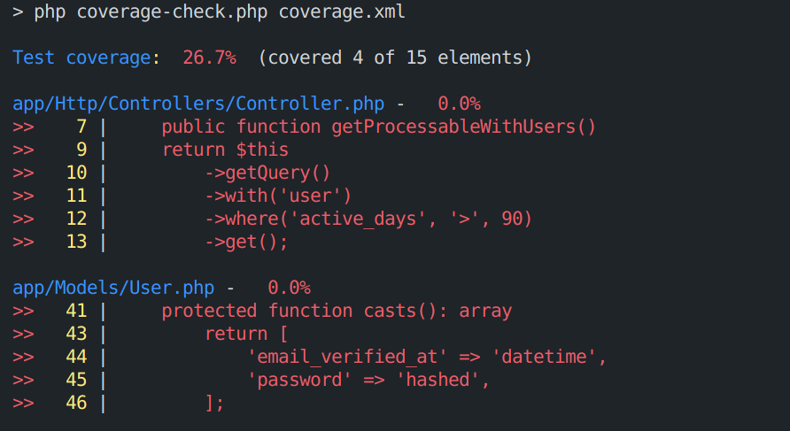

# Quick summary of Test coverage in CLI

Display test coverage directly in your console with a compact, colorized summary.

This repository contains a small CLI helper script that parses a PHPUnit Clover XML coverage report and prints uncovered statements and methods with file/line context.

## Generate a coverage XML (Clover) file

Run from your Laravel or project root so file paths in the XML match source files.

- PHPUnit:
```bash
./vendor/bin/phpunit --coverage-clover=coverage.xml
```

- Laravel:
```bash
php artisan test -- --coverage-clover=coverage.xml
```

- Laravel with Xdebug environment:
```bash
XDEBUG_MODE=coverage php artisan test -- --coverage-clover=coverage.xml
```

## Run the coverage checker

Place coverage-check.php in your project root and run:

```bash
php coverage-check.php coverage.xml
```


## Notes & troubleshooting

- "File not found" or missing source lines: ensure you ran generator from project root and source files are present in the working directory.
- "Failed to parse XML": confirm PHPUnit produced a valid Clover XML.
